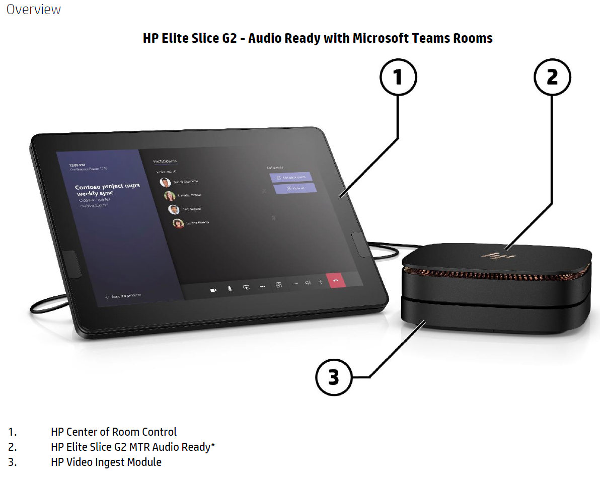
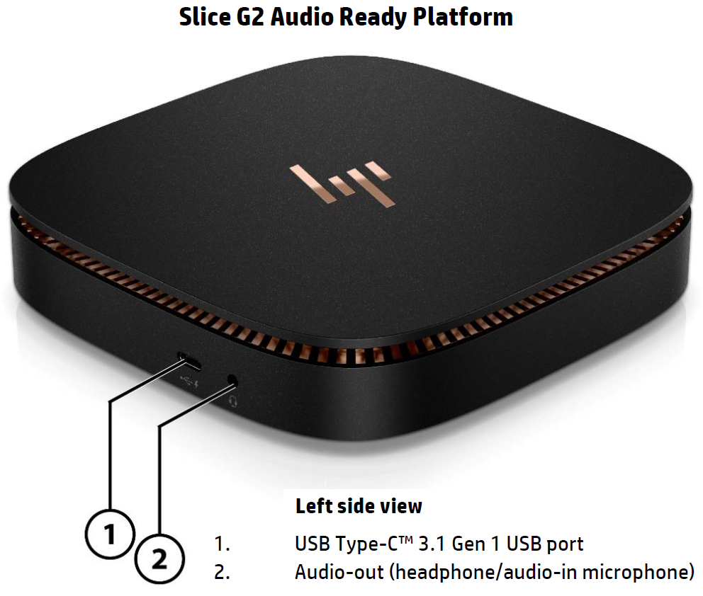
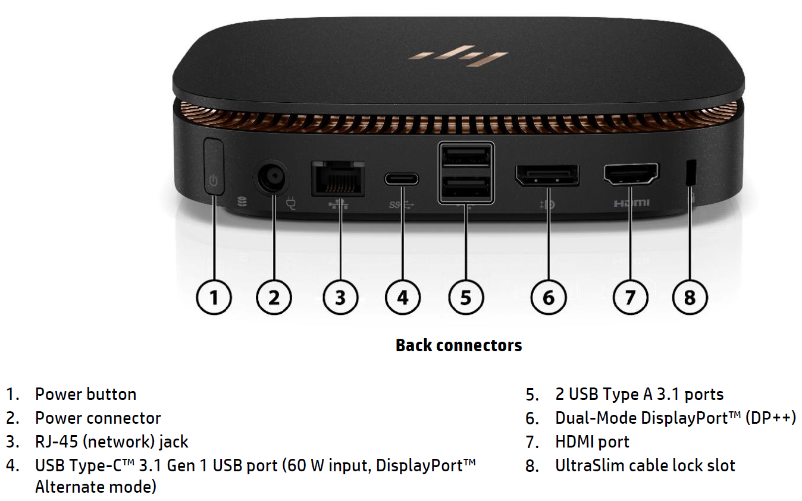
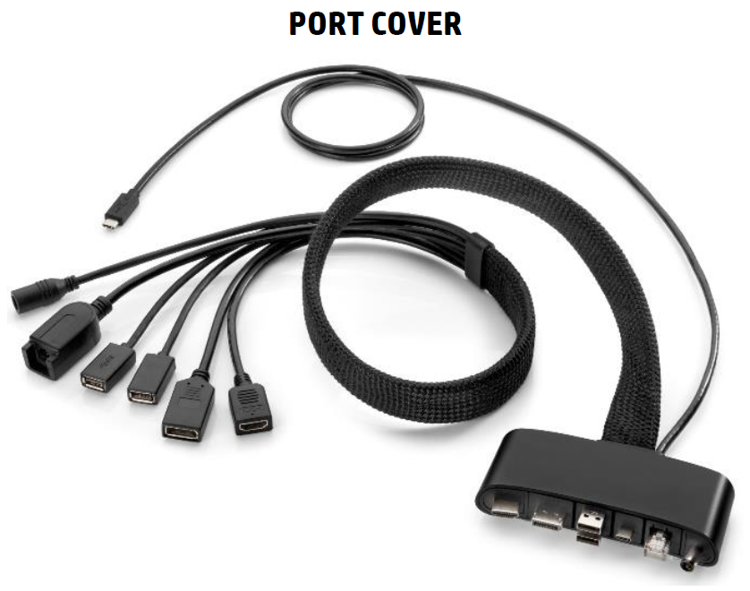
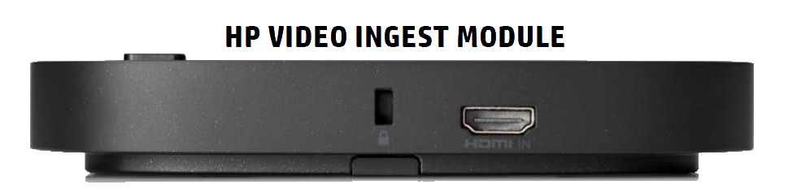
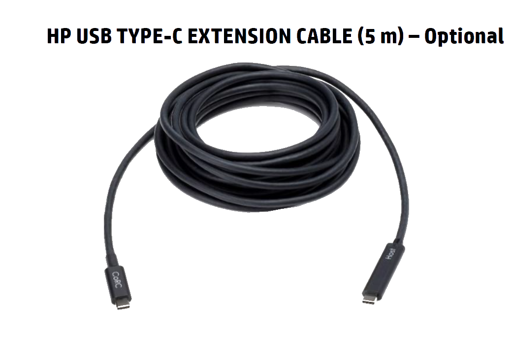

# HP

# It should look like this with module connector port

# Overview of HP Elite Slice G2 - Audio Ready with Microsoft Teams Rooms

#

# Slice G2 Audio Ready Platform - Left side view

# Slice G2 Audio Ready Platform - Back connectors

# Slice G2 Audio Ready Platform - Port Cover

# Slice G2 Audio Ready Platform - Video Ingest Module

# Slice G2 Audio Ready Platform - USB TYPE C Cable

